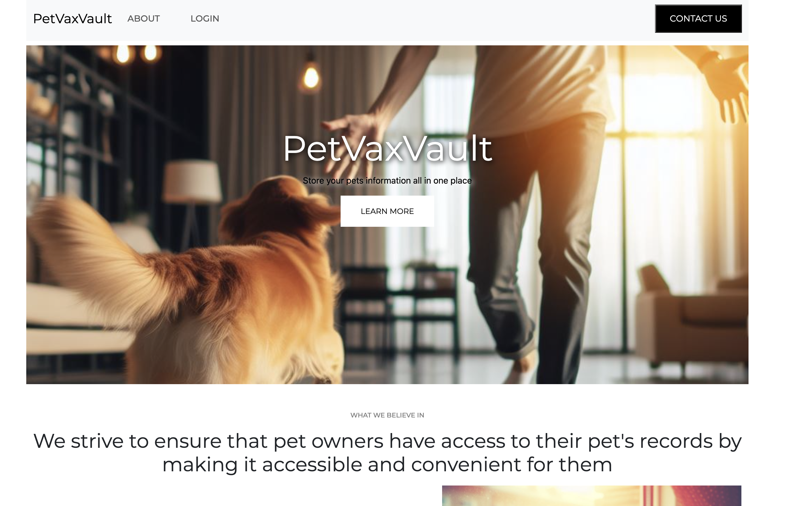
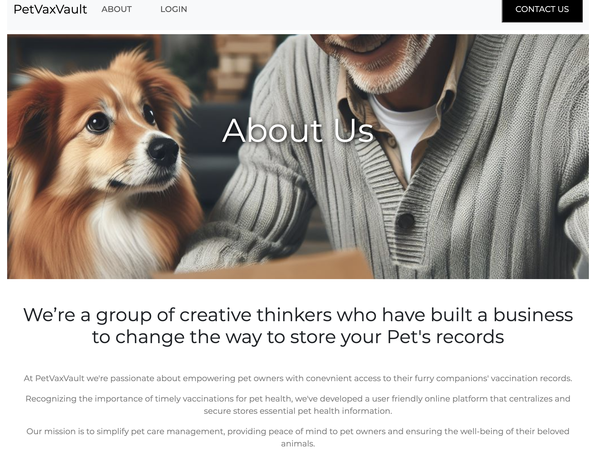
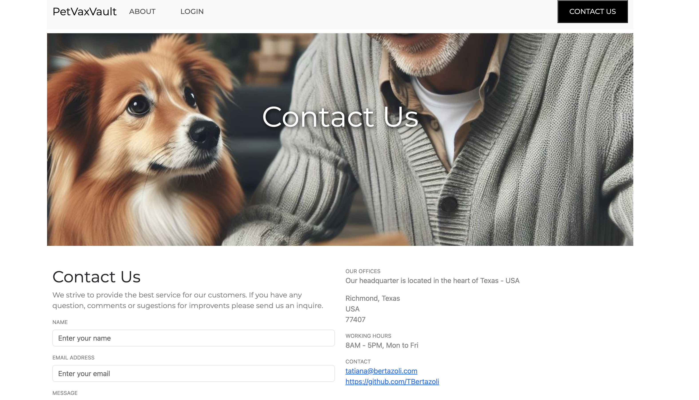
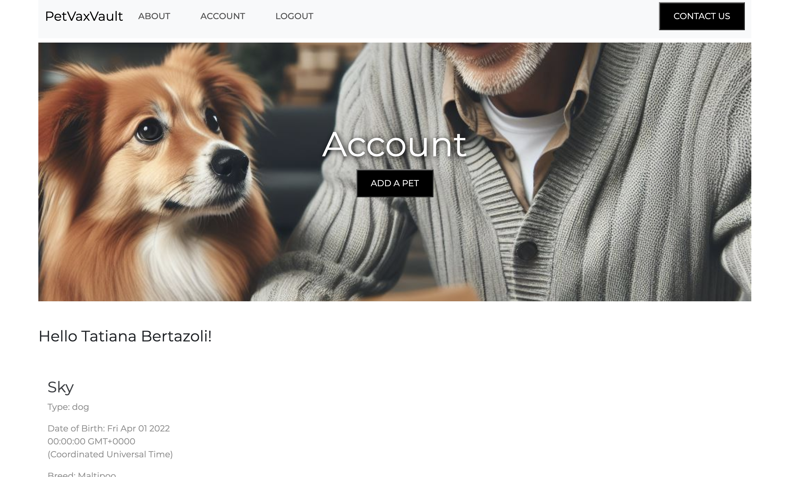
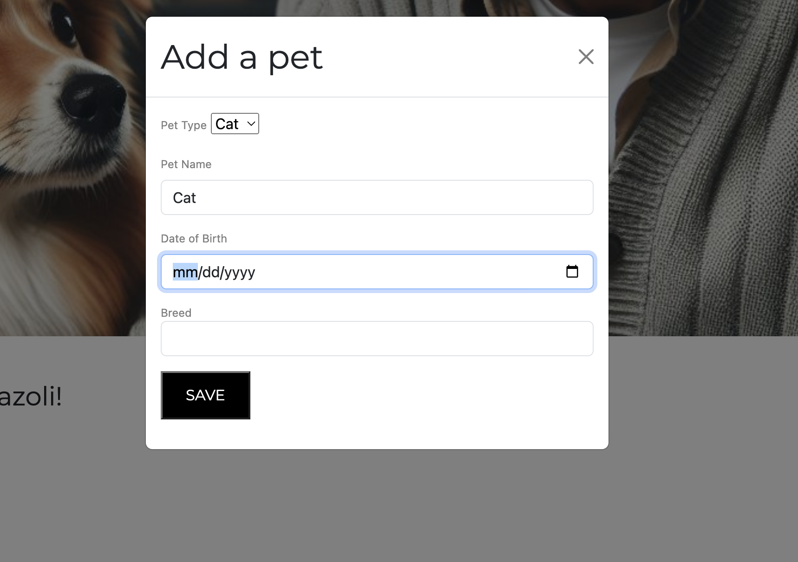
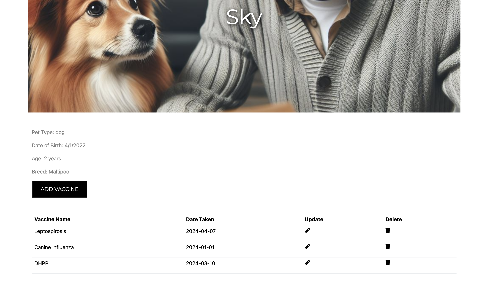

# VetVaxVault

## Screenshots

Landing Page

About Us Page

Contact Page

Account Page

Add a Pet Modal

Pet Page

## Description

VetVaxVault is a mobile user-friendly website designed to streamline the storage and retrieval of crucial information about your beloved pets. VetVaxVault provides a secure and convenient platform to organize and access all your pet-related data. Say goodbye to scattered paperwork and hello to effortless pet care management with VetVaxVault. All images were AI generated.

## Table of contents

- [Description](#description)
- [Screenshots](#screenshots)
- [Technologies Used](#technologies-used)
- [Getting Started](#getting-started)
- [Credits](#credits)
- [Future Enhancements](#future-enhancements)
- [Questions](#questions)

## Technologies Used

- HTML
- CSS
- JavaScript
- Bootstrap
- ejs
- Exprees.js
- MongoDB
- Moongose
- google Oauth
- AI

## Getting Started

1 - Access the [website](https://vet-records-64d6176bd1f1.herokuapp.com/).  
2 - Upon acessing the website the user can access the about me page and contact page.  
3 - To be able to access other features the user has to login first using google oauth.  
4 - After Login the user lands on the account page where he has access to the account features.  
5 - User can create a Pet.  
6 - User can add/edit and delete vacination information from each pet.  
7 - Link to [trello](https://trello.com/invite/b/RjLkH3HY/ATTIdcf98f751a50540d214cd5a38699147dEA83C1A7/vaccine-record) project planning.

## Credits

Tatiana Bertazoli

## Future Enhancements

1 - Add Edit and Delete features for pets  
2 - Create other option for login  
3 - Create a page that will contain information about the vaccines required for each pet and when they should be administered.  
4 - Expand the database to other types of animals

## Questions

For questions please contact: tatianabertazoli@gmail.com

GitHub repository [link](https://github.com/TBertazoli/vet-records)

Heroku deployed [link](https://vet-records-64d6176bd1f1.herokuapp.com/)
